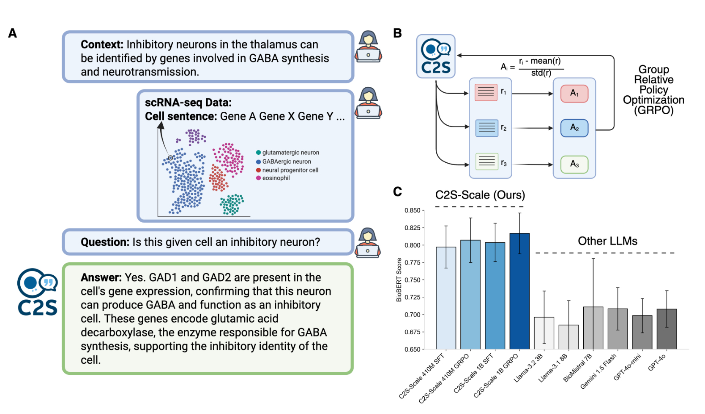
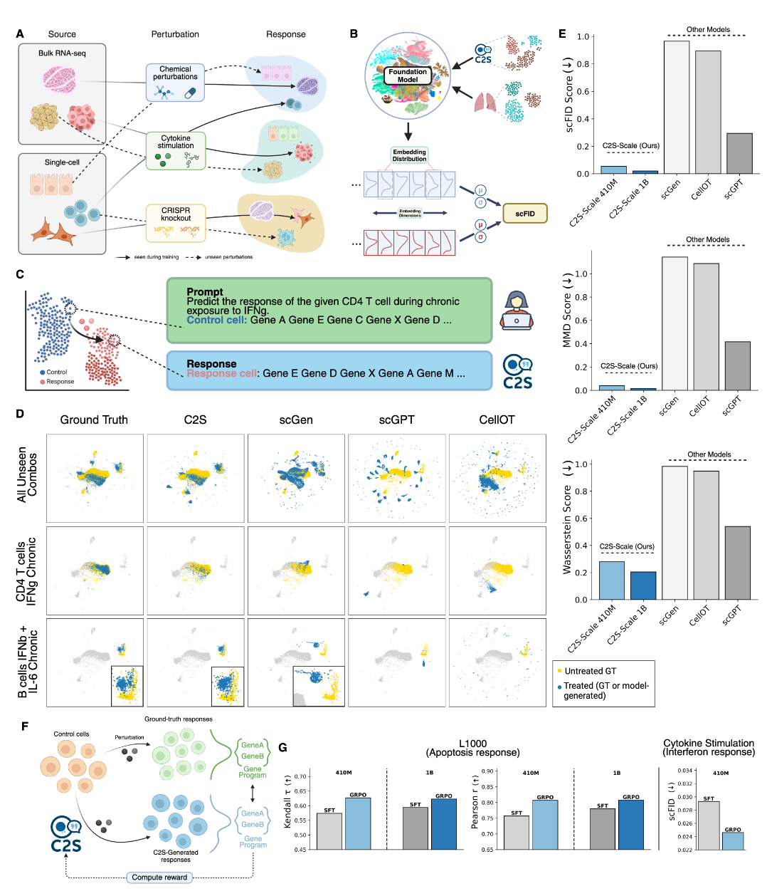

# SCALING LARGE LANGUAGE MODELS FOR NEXT-GENERATION  SINGLE-CELL ANALYSIS

## Abstract

受启发于Cell2Sentence，作者提出基于LLM的单细胞分析框架。

为了适应：
- 模型增大 Model Capacity
- 数据集增大 Dataset Size
- 多模态 Multimodality
- 多样数据分布 Context Diversity (multi-cell support)
- 生物学尺度/分辨率 Bio-scale Scales (integration across biological scales)
- 不同尺度 Biological Insights (from single cells to organism-wide insights)

利用了：
- 转录组数据
- 生物学文本
- 元数据

提出的基于LLM的模型框架具有良好的scaling和效果，超越了传统的专业sc模型和通用语言模型。

## Introduction

现有模型flexibility and scalability不足

专业模型如 scGPT Geneformer 等，依赖于固定的表达（expression-only）框架，框架固定而无法处理多模态数据和多下游任务。

此外这些模型，仍然可以看作一种较简单的拟合器，而这种类型的模型在数据集小时，scaling能力差，而且适应各种下游任务的方式死板（如CellFM虽然可以做下游任务，但是依赖很多固定的下游任务框架，本身仍然只做特征提取的工作）

我们考虑LLM的amazing的数据/任务分析/处理能力，因此考虑使用LLM作为基础来构建一个端到端的多模态多任务模型。

实际上LLM只是作为一种任务解决的载体，以自然语言为载体具有无与伦比的flexibility

1. 自然语言是一种统一表示方式 → LLM 成为通用解法
2. 特征空间的“语言结构”提供了先验约束，有利于泛化
3. Scaling 本质上依赖于任务结构的学习难度 → 语言带来的“压缩特性”有助于scaling

提出了C2S-Scale框架，重点关注以下几个方面：
1. 模型容量
2. 模型性能
3. 数据集规模与多模态性
4. 上下文长度与多样性
5. 下游应用

### 具体贡献

1. **Scaling Single-Cell Analysis with LLMs**：我们提出C2S-Scale，这是一个新系列的LLM，旨在从多个维度稳健地扩展单细胞分析：
   1. **Larger Model Capacity**：C2S-Scale包含从4.1亿到270亿参数（410M、1B、2B、9B和27B）的模型，基于Gemma-2 [15]和Pythia [16] LLM架构。这代表了与现有单细胞基础模型相比，模型容量的显著增加，使得能够捕捉数据中更复杂的关系。

   2. **Increased Performance at Scale**：我们建立了LLM在单细胞分析中的性能扩展规律，展示了随着模型规模从4.1亿到270亿参数的增加，在**预测和生成任务**中显著提升的性能。在保留的测试集上的评估显示，较大模型在多样的单细胞任务中具有更好的泛化能力。这些扩展趋势在**全量微调和参数高效的情况下均有观察**，突显了即使在**有限计算资源下扩展**的实际效用。

   3. **Data Size and Multimodality**：C2S-Scale模型在一个包含超过5000万个个人和小鼠细胞的1亿标记的多模态语料库上进行训练，相关的元数据和注释来自公开可用的单细胞图谱，如人类细胞图谱 [3] 和CellxGene [2]。通过同时训练**转录组数据**和相应的**生物文本**（例如论文摘要），C2S将单细胞转录组数据与自然语言和生物背景对齐。该语料库被格式化为1.5亿个多任务训练样本[表1]，使得LLM能够学习多样的任务，同时**整合注释和自由文本信息**。

   4. **Long-Context, Multi-Cell Capabilities**：C2S-Scale模型支持最长8192个标记的扩展上下文长度，使得能够处理更全面的多模态和多细胞输入。重要的是，**C2S-Scale可以同时处理和生成多个细胞的数据，从而能够分析细胞间的相互作用和复杂的生物过程**。扩展的上下文还允许整合多样的上下文信息，包括**生物注释、手稿文本、扰动条件以及更详细的任务特定指令**。

   5. **Diverse Downstream Applications**：C2S-Scale模型在比以往模型更广泛的下游任务上进行了微调和评估，涵盖了具有挑战性的**生物推理任务**，如**扰动预测、单细胞数据的细致自然语言解释和复杂的问答**，展示了我们方法的多样性和适用性。

2. **Reinforcement Learning for Enhanced Performance**：受到在NLP中使用强化学习以使LLM与用户偏好对齐的启发，我们利用**群体相对策略优化**（GRPO）[17]进一步优化C2S以针对单细胞任务。我们量化了在具有挑战性的问答基准和扰动响应预测中，**通过GRPO实现的性能提升**。

3. **A Novel Metric for Evaluating Single-Cell Generative Models**：我们引入了**single-cell Fréchet Inception Distance (scFID)**作为评估指标，这是对广泛使用的Fréchet Inception Distance（FID）的适应，用于评估图像生成模型。与表达水平指标不同，后者可能受到高维噪声和异常基因的主导，scFID利用单细胞基础模型嵌入空间以生物学上有意义的方式评估生成细胞的质量。

4. **Open-Source Models and Resources**：我们向社区发布我们的代码和模型权重，以促进LLM基础单细胞分析的更广泛采用和进一步发展。这包括构建转录组-语言集成数据集和LLM基础分析提示的资源。

## Result

评估了
- scaling law
- tasks：
  - natural language interpretation of scRNA-seq data
  - spatial reasoning
  - question answering
  - perturbation response prediction

仍然使用了表达值排序的方式(ranking)，来将表达谱转化为自然语言句子。这种方式实际上信息损失很小，因为在很多下游任务中，相对大小的信息更加重要，不依赖于绝对数值（也可能是因为测序平台杂且多，绝对数值在这种数据分布下，意义不大）。**使用一个简单的线性模型就可以将rank复原回expression，且损失很小。**

### frame work and training

C2S-Scale的训练：
1. a self-supervised general pre-training phase on our large-scale corpus（学习知识、instruct）
   1. encompassing predictive and generative tasks on both single and multi-cell context (Table 1).
2. additional tuning for specific tasks

预训练阶段，需要进行predictive和generative的任务，同时需要学习一定的prompt和instruct。预训练进行了很多训练任务，在[表1]中列了出来

而在微调阶段，将会使用新的数据集微调。

### State-of-the-art Predictive and Generative Capabilities

在很多任务上媲美或超越了之前的模型

| 🧪 任务类别                                               | 🔁 输入形式                               | 🎯 输出目标                     | 💡 C2S-Scale 优势                                         | 🥇 性能对比                   |
| ----------------------------------------------------- | ------------------------------------- | --------------------------- | ------------------------------------------------------- | ------------------------- |
| **细胞类型注释**                                            | `cell sentence` + prompt              | 自然语言中的 cell type label      | - 无需特定分类头 - 能直接理解细胞句语义 - 使用通用 LLM prompt 格式       | ✅ 竞争于或优于 scGPT、Geneformer |
| **细胞嵌入生成**                                            | `cell sentence`                       | 高维语义嵌入向量                    | - 向量同时包含表达和上下文语义 - 可用于聚类 / 可视化 / 迁移学习                | ✅ 表达和上下文信息最丰富             |
| **多模态整合（single-cell vs bulk）**                        | `cell sentence` + paired bulk         | 比较 embedding 相似度（zero-shot） | - 未在 bulk 训练也能对齐 - 可泛化到未见模态                          | ✅ 表现最稳定的一致性嵌入             |
| **扰动响应预测**                                            | `cell sentence` + perturbation prompt | 表达响应的自然语言或向量表示              | - 无需修改结构 - 可预测组合扰动与新条件                               | ✅ 对未见扰动有泛化能力              |
| **文本生成任务（cluster captioning / dataset summary / QA）** | 聚类/数据/问题 + prompt                     | 自然语言输出（描述/回答）               | - 能理解图结构、上下文与表达信息 - 远优于常规 LLM（LLaMA, GPT-4o, Gemini） | ✅ 明显优于 SOTA LLM           |
| **跨数据集泛化**                                            | 完全新数据集的 cell sentence                 | 多任务输出（如注释/聚类）               | - 具备通用生物语义 - 不依赖训练数据分布                               | ✅ 对未见研究也能很好泛化             |

优势：
- 统一模型结构 → 无需为不同任务更改网络
- 自然语言接口 → 易用、可解释、灵活 （不只是简单的任务，还可以提供论文等作为input）
- 泛化能力强 → 跨模态、跨组织、跨任务迁移均表现优异
- 生物学语义合理性强 → 得益于“cell sentence”结构

### Scaling Laws for LLMs in Single-Cell Analysis

### Natural Language Interpretation at Multiple Scales of Biology

介绍 C2S-Scale 在单细胞分析中，如何通过自然语言实现 细胞级 → 聚类级 → 数据集级 的解释。

现有的基于大语言模型的单细胞模型（如 GenePT、scGenePT）在整合自然语言与单细胞数据方面能力有限，它们主要侧重于在结构上使用语言 embedding，而不是进行真正的自然语言解释。（也就是文本输入，然后提取生成的embedding而不是直接生成文本来解释）

| 🧪 生物学尺度            | 🎯 任务名称                | 输入形式                  | 输出形式       | 评估指标         | C2S-Scale 优势    | 性能表现                 |
| ------------------- | ---------------------- | --------------------- | ---------- | ------------ | --------------- | -------------------- |
| 细胞级（Cell level）     | Cell Type Annotation   | 单个 cell sentence      | 自然语言细胞类型标签 | 准确率 / F1     | 语言表达、泛化强        | ✅ 可与 SOTA 比肩         |
| 聚类级（Cluster level）  | Cluster Captioning     | 一组 cell sentences（聚类） | 一段自然语言描述   | BioBERTScore | 会聚类 → 会写生物描述    | ✅ 超越 GPT-4o、Gemini 等 |
| 数据集级（Dataset level） | Dataset Interpretation | 多个聚类 / 全数据句子          | 数据集的摘要描述   | BERTScore    | 跨任务通用性强，能总结新数据集 | ✅ 在全模型中得分最高          |

Cluster Captioning 是在分析一组细胞（cluster）的任务，而这些 cluster 通常 是具有生物学意义的，通常对应一个细胞类型或亚群。caption通过gpt-4o根据细胞注释生成

GPT-4o进行数据标注：
1. 获取一个标注数据集（包含细胞类型注释、组织来源、疾病状态等信息）。
2. 使用 GPT-4o 生成聚类级和数据集级的自然语言描述。
3. 将生成的描述作为“参考答案（pseudo-ground truth）”。
4. 利用该参考答案进行 C2S-Scale 的训练或评估。

### C2S-Scale Learns Spatial Reasoning from Multi-cell Context and Interaction Data

C2S-Scale 的空间推理能力章节（2.5），是全文最关键的能力扩展之一，展示模型在无结构约束、纯表达输入情况下自动学习细胞空间组织与交互关系的能力。（所谓spacial，这里其实主要指的是相同微环境，而不是空间坐标）

C2S-Scale虽然没有为空间推理设计，但是由于可以接受多细胞上下文，因此天然可以用作**空间推理**。

只要**采样来自相邻区域的细胞并作为输入**，C2S 无需结构修改即可推理其空间关系。

为了验证，在一个人类肝脏空间转录组数据集上测试模型预测空间邻域（neighbor）能力。

同时引入多个空间辅助任务来训练模型，通过这些任务训练，C2S 学会了稳健的空间表示能力，在预测空间邻域任务上显著超越 scGPT 和 GPT-4o：
- 微环境标签预测
- 邻近细胞生成
- 判断多细胞是否属于同一微环境

进一步假设**引入外部生物学知识（如基因互作网络）能增强模型的空间推理能力**。不引入硬编码规则，而是把来自 CellPhoneDB（受体-配体）与 BioGRID（蛋白互作）的知识转换成自然语言 prompt，输入给模型。在互作数据上微调后，C2S 的空间预测能力进一步提升，支持“外部分子上下文提升空间理解”的假设。

两者结合使用效果最佳，说明**多源互作知识融合有助于模型获得更丰富的空间理解能力。**（引入先验的外部知识，能够稳健的提升模型的能力）

C2S-Scale 没有通过显式的结构，而是只通过先验知识prompt训练，就能够获得上述能力，说明自然语言描述具有极大的潜力，能够显著增强模型的灵活性。

C2S-Scale的一个关键优势是它能够集成不同的数据源，而无需明确结构化地整合外部知识。因此我们可以通过提供数据而不是为特定任务设计定制框架，来完成/增强下游任务。模型可以只通过提供数据隐式的学习。

### Single-Cell Question Answering (QA) through Reinforcement Learning

问答（QA）任务是自然语言处理中的核心任务之一，常用于标准化测试模型是否具备理解信息与进行推理的能力，它们能用于评估模型在专业语境中的高级推理能力。

scQA 数据集包含 2000 组问答对，每组包括：
- 相关的生物背景
- 与之对应的 scRNA-seq 数据（从细胞群或注释中采样）
- 主要问题
- 最终答案

每个答案还附带关键词标注，用于辅助评估回答质量。

我们构建数据集的方法是：从 scRNA-seq 数据集中采样细胞，将这些数据与对应的生物学论文一起输入 GPT-4.5，由它生成具有生物学意义的问题与答案。

在进行监督微调（SFT）后，C2S-Scale 在 scQA 任务上超过了多个 SOTA LLM，说明：在**转录组数据+自然语言联合训练**下，C2S 更具优势。

我们引入强化学习（RL）方法：**Group Relative Policy Optimization（GRPO）**以强化QA能力。将 BioBERT Score（用于度量生物文本语义一致性）作为 RL 的奖励函数，引导模型生成更贴合生物知识的高质量答案。

经过 GRPO 训练后，C2S 在 scQA 数据集上的表现**显著优于**单纯 SFT 微调的版本，表明强化学习技术有望进一步优化 LLM 在单细胞专业任务中的能力。

### Perturbation Response Prediction

扰动预测的训练分为两个阶段：首先是监督微调（SFT），然后是强化学习（RL）优化。
- SFT 阶段，模型学习从未处理的细胞表达出发，预测其在目标扰动条件下的表达谱变化。
- RL 阶段，我们使用在线强化学习算法 GRPO（Group Relative Policy Optimization），以生物相关的目标函数优化扰动预测。

尽管 C2S-Scale 会预测完整表达谱，但现实中的功能筛选通常只关注某些表型相关基因，而非所有基因。GRPO 通过对关键功能基因集进行优化来解决这个问题，例如：（也就是说将先验知识如基因通路，通过grpo集成）
- L1000 数据集关注“凋亡”（apoptosis）；
- Dong 等数据集中关注“干扰素反应”（interferon response）。

奖励函数仅基于这些特定功能基因子集计算（见图 8F），从而实现更有针对性的优化，并提升对分布外扰动的泛化能力（见图 8G）。

此外提出了一种新评估指标 scFID，它改编自计算机视觉中常用于衡量生成图像真实性的 FID。scFID 使用 单细胞基础模型替代 Inception-v3，嵌入转录组表达数据，实现生物学语义上的相似性评估。不同于原始表达空间中的 MSE 等指标，scFID 在语义空间中更稳健，不易受到噪声和离群基因影响。

模型能够泛化到从未见过的细胞类型 + 因子种类 + 作用时间组合。GRPO 进一步降低了干扰素相关基因上的 scFID 分数，说明其在免疫通路上的生物一致性更强。

强化学习不仅提高了模型**对生物学响应的拟合程度**，还增强了其**对训练分布之外扰动的泛化能力**。

## Limitations

1. 因果注意力限制

### Addressing Limitations of Causal Attention in Gene Expression Modeling

1. ranking中，表达值从大到小排序；而因果掩码可能限制了高表达量基因对低表达量基因的关系建立。

但是**这种限制并不会严重阻碍训练目标**，且可以使用几种策略来缓解。

我们的方法与视觉-语言模型中的成功范式一致，在这些模型中，即使使用任意的 token 顺序并结合因果注意力（causal attention），仍然可以达到最先进的性能。（多模态模型中，对齐后将token加入gpt式模型中，仍然效果可以很好）

类似于结合因果与非因果注意力层的混合视觉架构，我们的框架也可以通过辅助推理 token 或非因果的基因交互来引入间接的双向上下文。

### Multi-cell context and reasoning as a corrective mechanism

模型的推理能力提供了额外的纠错潜力。语言建模中的最新研究表明，显式的推理步骤可以弥补因果注意力的局限。（通过引入“思考路径”（例如中间变量、辅助任务），可以让模型绕过单向注意力的限制。）

在我们的应用中，表示生物通路或基因互作的中间 token 支持迭代式的预测优化，从而有效地规避了严格的单向限制。

此外，我们的多细胞训练框架带来了隐式双向性——一个细胞中低表达的基因可以影响下一个细胞中高表达的基因，从而在多细胞上下文中近似双向注意力机制。（多细胞的任务能够提供隐式的逆向关系建模，虽然这看起来是两个不同的细胞的基因间关系，但是由于模型的泛化能力，实际上能够隐式的逐渐学习到单个细胞内，逆向的关系。）

### Correlation, not causation（相互关系而非因果关系，双向而非单向）

我们的模型旨在捕捉预测性的相关关系，而不是推断因果性的基因关系。（即使使用的是因果注意力）。这与自然语言处理中自回归模型的情况类似，尽管词序有时与真实的因果关系不一致（如被动语态），但模型仍能成功捕捉统计相关性。（通过大量的数据训练，能够通过数据分布潜在的学习到逆序的关系）

### Architectural enhancements

我们提出三种架构增强方法来进一步缓解上述限制：
1. 通过划分基因序列实现局部双向注意力；
2. 训练时引入多样化的基因排序，以诱导模型对顺序的不变性；
3. 构建因果与非因果注意力层融合的混合注意力架构。

虽然我们当前的方法已经表明，即使缺乏自然顺序，基于预训练 LLM 的顺序建模仍然有效，无需定制架构；但这些增强方法将进一步提升其生物学保真度与预测能力

2. 幻觉和可解释性

大型语言模型的一个已知挑战是它们容易生成看似合理但实际上错误的输出，这种现象被称为“幻觉”。虽然我们的基准测试主要集中在带有真实标签的结构化生物任务上，但对于更开放的解释任务（如摘要生成或簇注释），模型可能更容易出现此类错误。为提升可解释性与在关键应用中的可靠性，开发领域专用的安全机制（如**生物事实核查机制**或**受限解码策略**）是一个重要的研究方向。

在摘要生成的时候，可能出现幻觉（如依赖不存在的先验条件），我们可以通过指令微调的时候引入特殊的惩罚项来调整。

## Method

### Data Collection

使用了标准的数据处理流程：
1. quality control
2. normalization
3. log-transformation

保留了任何可以使用的注释数据，用于生成sentence

### Cell Sentence Transformation

**Ordering：**
1. 将基因表达谱标准化处理
2. 选取topk表达量的基因，降序排序
3. 选取基因的标准名称，使用空格分隔作为表达量sentence

细胞句中基因的排名和（标准化）表达水平之间存在很强的线性关系（在log空间中）。我们训练了一个 rank → expression 的线性模型（log space 下），在两个数据集上都能以 85% 的 $R^2$ 准确还原原始表达值，说明转为 cell sentence 后丢失的信息非常少。

在训练时，我们保存了每个数据集上 rank → expression 的线性模型参数，这样推理时就可以将 cell sentence 还原为表达向量。

**Multi-Task Prompt Formatting：**

通过使用自然语言操作，C2S-Scale 支持多种输入输出格式，从而适用于各种预测和生成任务，包括细胞类型和组织注释、多细胞生成任务、以及数据集解释任务。

annotation task
例如：Predict the cell type of this cell: Gene1 Gene2 ...
输出一个细胞名称

generative task
生成类任务，则相反：输入是元信息或条件，输出是生成的 cell sentence（即表达 profile 的文本形式）

自然语言 prompt 中的元信息可以包括：
- 细胞类型
- 组织注释
- 扰动条件（如用药、炎症等）
- 生物学摘要
- 疾病状态等

### C2S-Scale Architecture and Pre-training

#### Word Embedding in Transformers

使用原有的llm的embedding，而不是重新训练。直接将数据转化为文本，利用原有的LLM框架训练。

#### Attention Mechanism

因果注意力

注释数据放在cell sentence后面

#### Pretrain Objectives

预训练中，使用的是next token prediction，得到了cell sentence后，annotion也被追加在后面，然后使用LM任务来预训练。

在下游任务中，会根据特定的任务模式来进行微调。（指令对齐等，都要在下游任务的微调中进行）

#### Post train

1. sft

预训练后，C2 S-Scale会根据特定任务的数据集进行微调，以使模型适应单细胞分析中的下游应用。在此阶段，使用标记数据来训练模型，以执行细胞类型注释、组织级分类和细胞生成等任务。**下一个令牌预测**[58]再次用于监督微调阶段，并为下游任务格式化自然语言提示。

2. lr

为了进一步提高生成性和解释性任务的性能，我们利用RL技术，旨在使用奖励建模45将LLM输出与首选标准保持一致。具体来说，我们采用GRPO，这是一种基于奖励的方法，它根据与任务特定标准相关的梯度信号直接更新模型参数，从而使C2 S输出与生物准确性和可解释性保持一致。  GRPO流程首先使用SFT模型为每个训练示例生成多个候选输出。然后根据质量对这些候选人进行排名;在传统的NLP环境中，经常使用人类偏好排名。然而，在C2 S-Scale中，我们依赖于特定领域的标准和自动化指标，例如BERTScore [25]来评估与参考答案的语义相似性，以及回答等任务的反应的生物相似性。通过针对这些排名的输出进行优化，GRPO微调模型以支持更高的评分（即，更高质量和更符合生物学）的答案。  与其他RL方法相比，例如近端策略优化（PPO）[62]，**GRPO提供了更简化的工作流程：它不需要单独的奖励模型，而是直接将奖励信号（这里是基于bioBERT或特定领域的指标）合并到梯度更新中**。这种直接集成简化了对齐过程，使其对于C2 S-Scale等大规模模型特别有效。通过将优化重点放在生物相关指标上，GRPO能够对专门的单细胞任务进行一致的改进，确保C2 S-Scale以符合专家期望和高质量生物学见解的方式稳步改进其输出。

> 使用grpo简化流程，使用生物学评估模型代替人类完成自动化标注。

### Downstream Tasks

#### 1. cell type annotation

对于细胞类型注释任务，我们微调模型以预测免疫组织数据集[63]和肺数据集[19]上的细胞类型标签。我们使用每个数据集中80%的细胞进行训练，并保留20%用于评估。C2 S-Scale提供单元句和自然语言提示，例如“预测此单元格的单元格类型：”。C2 S-Scale使用与预训练步骤相同的下一个令牌预测目标[58]针对该任务进行了微调，预测自然语言中的细胞类型标签。

#### 2. cell generation

对于细胞生成任务，我们微调模型，以无条件或有条件地在免疫组织和肺数据集上生成细胞表达。该模型被给予一个自然语言提示，其中包含用于条件生成的相关元数据，或者在无条件生成的情况下没有信息，并且其任务是生成代表该条件下细胞表达的K个基因的细胞句子。例如，为了有条件地生成B细胞，模型可能会被提示：“按照表达递减顺序生成1000个基因的列表，这些基因代表B型细胞的智人细胞。"

#### 3. cell embedding

对于细胞嵌入，我们使用经过训练的C2S-Scale基础模型（例如C2S-Scale 1B），该模型在C2S多模态语料库上进行训练，以在**没有任何数据集特定微调的情况下嵌入细胞**。为了嵌入细胞，我们首先以与细胞类型预测任务相同的方式格式化C2S-Scale的输入提示。然而，我们不是解码令牌预测，而是从C2S-Scale模型的最后一层提取最后的隐藏状态，并对潜在向量进行平均池化，以形成输入提示的嵌入。我们注意到，这一过程也可以用于多细胞上下文以及涉及不同元数据和条件组件的自然语言提示，使C2S-Scale成为一个多样化的转录组和语言输入嵌入模型。

也就是说，把vocab之前的embedding做全局平均池化，不做微调。

#### 4. single-cell bulk integration

多模态整合对于捕捉生物系统的复杂性至关重要，因为不同的数据模态提供了对细胞功能的互补视角。每种模态都有其自身的优缺点——有些在**稀疏性上提供高分辨率，而其他模态则提供更广泛的覆盖**，但缺乏单细胞的细节。因此，能够整合模态的模型可以提供对细胞行为更完整和更稳健的理解，从而提高生物分析中的可解释性和预测能力。为了评估这一点，我们设计了一个简单的单细胞与大宗RNA测序整合任务。使用来自[19]的单细胞肺组织数据，**我们通过对供体、细胞类型和批次进行聚合来构建伪大宗样本**。对于每个伪大宗样本，我们从相同条件下随机抽取十个单细胞样本以构建配对。我们使用每个模型分别嵌入每个单细胞和伪大宗样本，并计算配对的单细胞和大宗样本之间的余弦相似度。根据[64]，我们使用“比真实匹配更接近的样本比例”（FOSCTTM）来评估每个模型的性能。FOSCTTM为0对应于一个完美的模型（匹配对的余弦相似度高于任何其他对），而接近0.5的FOSCTTM意味着匹配对之间的余弦相似度与随机对之间的余弦相似度大致相当。

这个评估方法的核心思想是：**一个好的多模态整合模型应该能够将来自同一生物学条件的单细胞数据和大宗数据映射到相似的表示空间中**，即使它们在原始数据格式和分辨率上存在很大差异。（也就是说，数据可能具有不同的形式，但是语义上应当相近）

#### 5. cluster captioning

为了生成聚类描述数据集，我们选择了30个scRNA-seq数据集，并进行标准预处理、聚类和差异表达分析。然后，我们提示GPT-4o [22]根据细胞类型、组织类型、生物体、疾病、前三个差异表达基因以及相关论文的全文为一个聚类生成五个描述。这导致我们获得了来自345个不同聚类的1,723个描述的总数据集。为了生成最终的训练数据，我们随机从一个聚类中抽取两个细胞以构建训练提示，并从该聚类中选择一个描述作为目标。C2S-Scale模型使用监督微调进行微调，学习目标为下一个令牌预测，学习率为1 × 10−5，权重衰减为0.01，批量大小为64。所有模型在同一保留测试集上进行评估，该测试集由训练数据中未见的聚类组成。

> cluster是相同细胞类型的细胞（如T细胞、B细胞、上皮细胞等），cluster中的细胞具有一定的差异表达基因。也可能是计算聚类。

#### 6. dataset intepretation

对于数据集级解释任务，我们创建了两个测试集： (i) 一个训练分布数据集解释测试集，其中scRNA-seq数据和论文摘要来自于613个从CellxGene [2] 收集的scRNA-seq数据集，作为C2S-Scale训练语料库的一部分； (ii) 一个超出分布（OOD）评估集，其中的论文和数据完全未被C2S-Scale模型见过。通过在训练语料库和超出分布数据的scRNA-seq研究上评估数据集级解释，我们创建了一个具有挑战性的泛化基准，以撰写有意义的scRNA-seq数据解释。

每个数据集解释样本是通过从给定的scRNA-seq数据集中抽取5到20个来自同一组织和供体的细胞创建的，并格式化一个包含多细胞上下文的提示，要求模型生成一个生物学摘要以描述数据。数据的摘要真实值是通过获取与该scRNA-seq研究相关的论文摘要获得的；为了在样本中看到更多样化的生物学摘要，我们使用GPT-3.5-Turbo-1106创建每个数据集摘要的500个变体，以防止模型仅仅记住几百个数据集摘要。对于每个多细胞上下文，我们选择其中一个摘要作为真实值目标摘要。示例摘要可以在图10中找到。

为了创建训练语料库分布数据集解释测试集，我们首先从训练语料库中收集保留的摘要生成样本。这些是模型在训练期间未见过的多细胞上下文和样本，因为它们是C2S-Scale语料库的保留验证和测试集的一部分。然而，由于每个数据集仅包含1个摘要，保留的样本仍将包含与模型已见过的训练集摘要生成样本相似的信息。我们从从CellxGene [2] 收集的613个数据集中抽取5个保留的摘要生成样本，得到了总共3065个数据集解释样本的测试集。

对于超出分布的数据集解释测试集，我们通过下载两个新的数据集构建新的摘要生成样本，这些数据集要么是最近发布的（在最初的C2S-Scale语料库收集期间之后），要么经过验证不属于C2S-Scale训练语料库：（i）一个胰腺组织数据集[65]和一个人类视网膜数据集[66]。我们从每个数据集中构建了200个样本，再次为每个数据集创建50个摘要变体，以提供更多的摘要语言多样性。

#### 7. spatial niche prediction

我们使用了CosMx空间分子成像人肝脏数据集[35]，该数据集提供了来自两个不同供体的正常肝组织和肝细胞癌肝组织的注释空间分辨的单细胞数据。该数据集包含超过800,000个单细胞，覆盖约180mm²的肝组织，表达测量基于1,000个经过筛选的基因。数据集经过处理，以过滤出在少于三个细胞中表达的基因和表达少于50个基因的细胞。然后将其归一化为总计1 × 10^4，并应用以10为底的对数。保存空间坐标以定义邻域并促进空间分析。我们将邻域定义为0.02像素（约20μm）的半径，选择这个半径是为了最大化我们可以适应模型上下文中的细胞数量。数据集根据空间坐标分为训练集和测试集，以防止集之间的空间泄漏。

为了训练C2S-Scale以处理空间和多细胞关系，我们设计了以下任务：

1. 生态位标签预测：给定单个细胞的细胞句子，预测该细胞的生态位标签注释。
2. 条件邻居生成：给定来自一个邻域的多个细胞句子，生成一个新的细胞句子，该句子将属于同一邻域。
3. 空间邻域预测：给定多个细胞句子，预测这些细胞是否来自同一邻域。
4. 相同生态位预测：给定多个细胞句子，预测这些细胞是否具有相同的生态位标签或不同的生态位。

为了构建提示，从适当的数据分割中随机抽取细胞句子。通过从抽样细胞的邻域中提取所有细胞来创建多细胞上下文作为正样本，或从邻域外随机抽取等量的细胞作为负样本。此外，为了增强模型对细胞通信的理解，我们包含了来自CellPhoneDB [36]和BioGRID [37]的基因交互元数据。我们限制数据仅保留涉及CosMx数据中1,000个基因的交互，并且仅限于编码细胞外蛋白的基因（通过MatrixDB [67]确定）。

#### 8. question answering

我们首先使用GPT-4.5模型从每篇手稿的三个部分（摘要、讨论和结果）以及从该研究中抽取的数据生成问答对。每个scRNA-seq研究贡献20对问答，总共使用约1600对问答进行监督微调（SFT）。我们以1 × 10−5的学习率和100个预热步骤进行SFT。在SFT之后，我们应用GRPO进一步优化答案质量。为了创建GRPO训练集，我们从未见过的研究中收集额外的600个样本，每个样本提示SFT模型生成32个候选答案。然后，我们使用BioBERT计算每个候选答案与GPT-4.5提供的真实答案之间的奖励分数，以捕捉其生物学合理性。这些由BioBERT得出的分数作为主要奖励信号，指导GRPO更新步骤，并优化模型参数，以偏向生物学上准确且上下文相关的响应。在GRPO训练中，我们设置β = 0.03，并使用5 × 10−7的学习率。最后，我们在一个来自未见研究的新测试集上评估经过GRPO优化的模型，并将其性能与常用的LLM进行比较，如图7所示。

#### 9. perturbation prediction

Dong等人的数据集包括暴露于单一和组合细胞因子的免疫细胞，每个细胞都根据类型、刺激和暴露时间进行注释——共计133种条件。我们保留5000个变异性最高的基因，**并在scGPT嵌入空间中使用最大均值差异（MMD）、Wasserstein距离和scFID（第5.7节）来评估模型**。这种基于嵌入的评估提供了比表达水平指标更有意义的比较，因为后者可能会受到少数极端值基因的影响。

C2S模型在Dong等人数据集上的训练遵循了一个结构化的两阶段过程，以有效预测对未见细胞因子刺激的反应。测试数据集包含三个难度逐渐增加的保留扰动层级：(1) 完全排除的组合扰动（干扰素-β + IL-6），(2) 针对每种细胞类型在慢性和急性条件下完全排除的一个扰动（B: 干扰素-III，CD4 T: 干扰素-γ，CD8 T: 干扰素-α2，树突细胞: 干扰素-β（无慢性细胞），NK: IL-6），以及(3) 在慢性或急性条件下为每种细胞类型排除的一个扰动，而另一种条件仍然在训练中（B: 急性干扰素-β，CD4 T: 急性干扰素-β + 干扰素-γ，CD8 T: 慢性TNF-α，NK: 慢性干扰素-III）。

在第一阶段，**模型通过监督学习对细胞句子生成和自然语言标签预测进行微调，同时预测所有三个标签——细胞类型、扰动和暴露**——确保它学习了**条件与基因表达之间的双向关系**。此微调阶段在单个H100 GPU上使用Hugging Face Trainer进行3-4个周期的训练。

第二阶段采用**GRPO来优化扰动响应生成**。对于Dong等人数据集，奖励是通过**生成的细胞与真实细胞之间的负均方误差计算的**，这些细胞在相同条件标签下随机配对，并使用scGPT进行嵌入。GRPO训练每个提示使用32个生成的响应和32个真实细胞，并在4个H100 GPU上进行3个周期的训练。用于GRPO的干扰素子集被定义为MSigDB [68]干扰素-α和干扰素-γ标志基因集的并集，与数据集中高度变异基因（HVGs）交集，最终得到95个基因。

为了与其他扰动响应模型进行基准比较，我们包括了scGen、CellOT和scGPT。对于scGen，我们使用pertpy库 [69]生成扰动预测。对于CellOT，我们遵循标准程序，但将编码器替换为来自scGen的预训练编码器。对于scGPT，我们为细胞类型、扰动和暴露添加了线性编码器，将二进制向量投影到稠密向量中，然后将这些嵌入添加到每个基因令牌嵌入中，再通过模型进行前向传播。

对于L1000数据集 [46]，我们在978个标志基因上进行训练，遵循分位数归一化。我们通过匹配细胞系名称将未处理和处理的样本配对。为了评估泛化能力，我们选择了50个样本总数少于1000的扰动，并在每个扰动中保留一半的细胞系作为测试数据。在强化学习过程中，我们使用**Kendall’s Tau作为奖励函数**，因为它能够正确处理平级排名。这对于L1000尤其重要，因为未表达的基因共享相同的最低排名。

SFT使用批量大小为2和梯度累积为32进行，学习率为1e-4。训练在单个H100 GPU上运行3500步（大约一个周期，尽管由于数据集大小并非所有数据都被看到）。对于GRPO，模型使用批量大小为8和梯度累积为4进行训练。我们为每个提示生成24个响应。学习率设置为1e-6，β值为5e-3。训练分布在四个H100 GPU上——三个用于模型训练，一个用于基于vLLM的响应生成。GRPO在3个周期内大约运行3000步，尽管与SFT一样，由于数据规模，模型可能看到的周期少于完整周期。仅在GRPO期间使用了MSigDB标志集中的凋亡基因，这些基因出现在L1000标志基因列表中，总计40个基因。