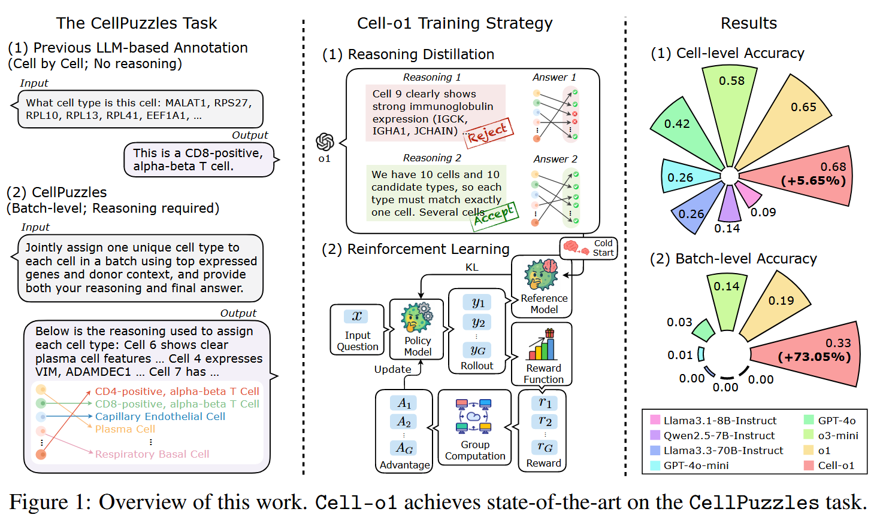
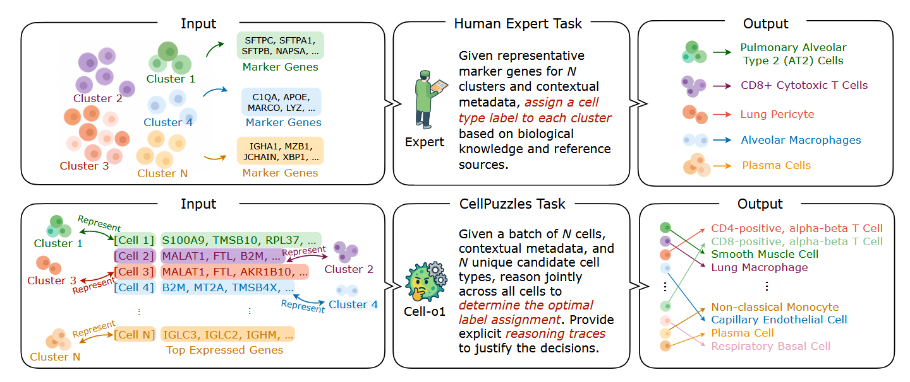
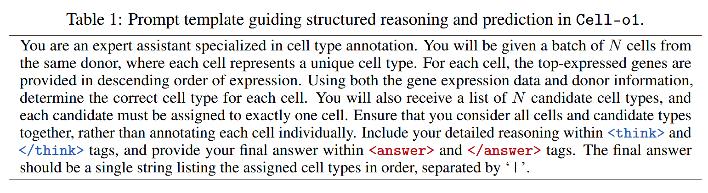
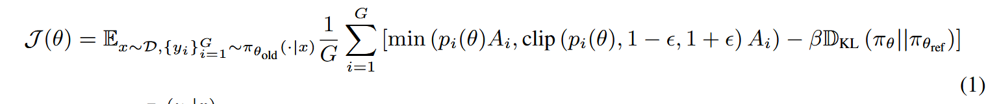
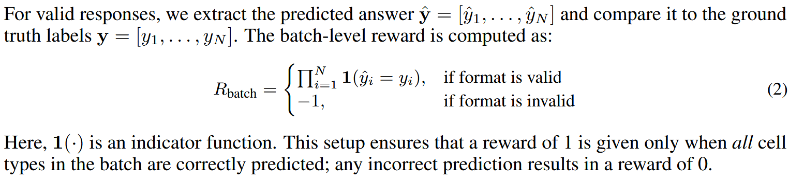
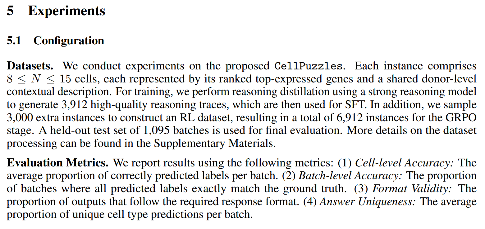
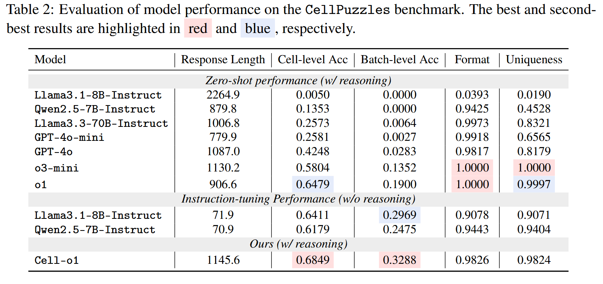
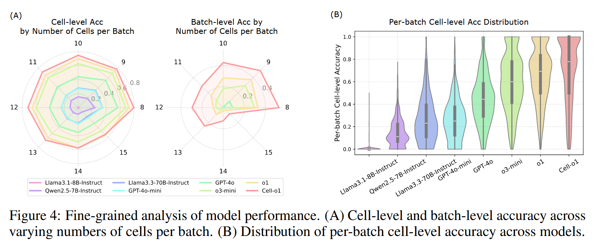
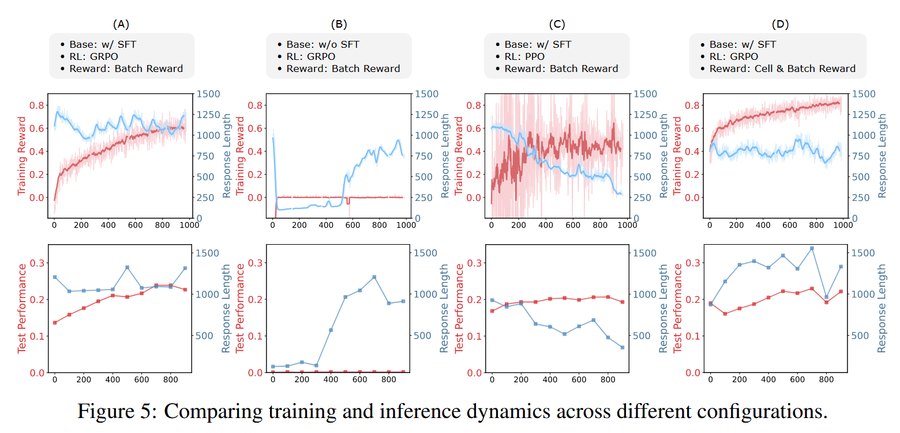
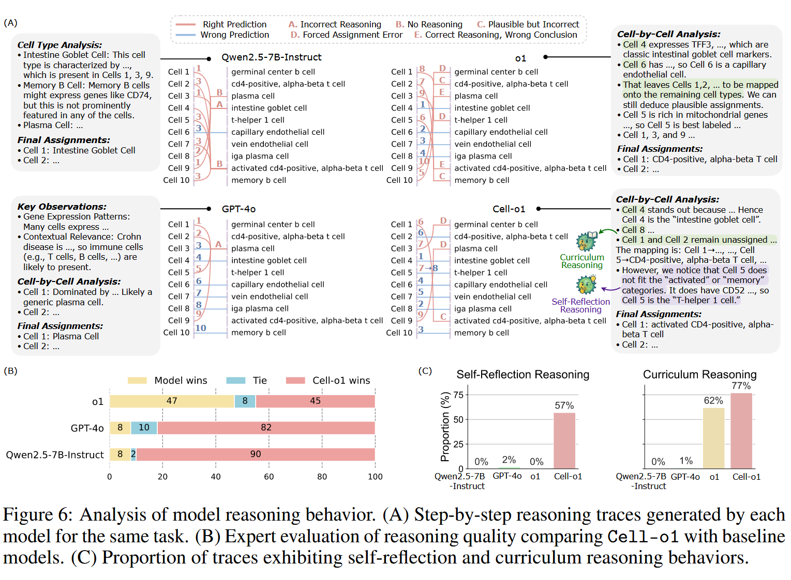

# Cell-o1: Training LLMs to Solve Single-Cell Reasoning Puzzles with Reinforcement Learning

## Abstract

这篇 Cell-o1 的论文核心在于模拟人类专家的注释策略，通过引入一个新的任务 CellPuzzles，推动模型在批次级（batch-level）上下文中进行更合理、可解释的细胞类型注释。

现有方法的局限
现有的 Foundation Models（如 scGPT）虽然能做细胞注释任务，但通常是逐个细胞预测标签。它们忽略了整个细胞批次的上下文信息，因此缺乏一致性与专业性，无法模拟专家注释时基于群体特征差异的判断。并且缺乏可解释的推理过程，难以满足生物学家的需求。（充分利用LLM的reasoning能力）

CellPuzzles：任务设计
- 输入：一批细胞（一个 batch），可能来自不同组织、疾病状态或供体。
- 目标：为这批细胞分配一组唯一的细胞类型标签，要求批次内标签不重复（仿照专家区分不同 cluster 的行为）。
- 挑战：需要模型进行跨细胞的对比、推理，而不是独立决策。

## Introduction

将准确的细胞类型分配给单细胞 RNA 测序（scRNA-seq）数据，是理解组织、疾病及个体间生物学异质性的关键。
传统的注释流程高度依赖专家知识：

- 通常先进行聚类，将相似细胞归为一组；
- 然后人工查看 marker 基因表达，结合生物学知识为每一类细胞手动赋予标签。

这种方法虽然准确性较高，但过程耗时费力，且难以扩展到大规模或全新数据集。

无论是 foundation model 还是 LLM，目前都倾向于独立注释每一个细胞，**忽视了细胞间共享的生物上下文或批次级表达信息**，这与专家的批量推理注释方式本质不同 [20]。此外，多数自动化方法是“黑箱式”的直接预测，缺乏清晰的推理过程，因此难以解释与验证.

为弥补上述差距，我们提出了 CellPuzzles——一个全新的基准任务，它将细胞类型注释重新定义为一个**批次级推理任务**，**更加贴近专家的注释流程**。如图 1 所示，与传统方法逐个注释细胞不同，CellPuzzles **要求在一个批次内联合地为所有细胞分配唯一标签，利用其表达谱与共享的上下文元信息**。广泛评估显示，即使是最先进的大语言模型（如 OpenAI 的 o1 [22]），在该任务上也表现不佳，批次准确率仅为 19.0%，反映出任务的挑战性。

在 CellPuzzles 上，Cell-o1 在细胞级与批次级准确率上都超越所有基线模型。对训练动态、推理行为与预测错误的进一步分析显示，模型具备良好的泛化性、解释性与推理能力。特别地，Cell-o1 展现出类似人类专家的**“自我反思（self-reflection）”行为（即重新评估与修正预测）与“课程式推理（curriculum reasoning）”**（即先解决简单样本再处理复杂样本）[23–26]。

创新：
1. 利用LLM的reasoning能力，模仿人类专家进行注释任务的流程。
2. 利用batch-level的上下文信息
3. 提出了一个benchmark，用于评估利用batch信息的能力

## Related Work

### 传统方法

手动进行细胞类型注释通常遵循一个多步骤的流程，结合聚类、marker 基因识别和基于参考的标签分配。首先，使用无监督聚类算法（如层次聚类（hierarchical clustering）、Louvain 或 Leiden 算法 [3, 4]）将细胞分组。随后，专家检查这些聚类结果，识别能区分不同群体的 marker 基因，并结合生物学先验知识与构建好的参考数据库为细胞分配类型标签 [5, 6]。

整个注释过程往往需要反复迭代，包括整合多个数据来源和多次评估，以逐步提升准确性。尽管这种专家驱动的方式在实践中被广泛采用，但它存在一些明显问题：效率低、人工成本高，并且强烈依赖领域知识。当应用于大规模或多批次的数据集时，其可重复性和可扩展性都受到限制 [5, 8]。此外，这种方法无法系统性地整合上下文生物信息，因此在鲁棒性和可解释性方面也存在局限 [27]。

### foundation model

近年来深度学习的发展推动了**单细胞基础模型（foundation models）**的涌现，这些模型旨在通过深层表示学习（deep representation learning）捕捉复杂的基因表达模式 [9–11]。这类模型多构建于 Transformer 架构之上，并利用大规模单细胞转录组数据集进行广泛的无监督预训练，从而提升特征表示的质量和在各类下游任务中的表现。

这些基础模型展现出了卓越的迁移能力，能将所学知识应用于多个不同数据集与任务中，包括：

- 细胞类型注释（cell type annotation）[9, 10]，
- 基因调控网络推断（gene network inference）[28, 29]，
扰动效应预测（perturbation prediction）[30, 31]。

尽管如此，这些模型通常仍以单细胞为单位独立地进行注释，而非在多个细胞间进行推理。此外，它们在**zero-shot（零样本泛化）**场景下的性能仍然有限，往往仍需借助额外的标注数据进行微调 [9, 10, 32]。

### LLM-base

近期有研究探索将单细胞基因表达数据适配为大语言模型（LLM）的输入，从而利用它们在指令跟随、表示学习和泛化能力等方面的优势 [33, 34]。借助 LLM 的指令理解能力与上下文学习（in-context learning）能力，它们可以快速适配不同的单细胞任务，这在传统单细胞分析方法中是难以实现的 [35, 36]。

为了弥合 scRNA-seq 数据与语言模型之间的模态差异，研究者提出了多种策略，例如：

- 按表达水平对基因排序，构成有序列表 [12, 13]；

- 基于人工构建的文本描述为基因生成嵌入 [14, 15]；
- 直接将原始表达谱编码进多模态架构中 [16–19]。

这些方法使得 LLM 能够处理生物信息，并在文本或多模态框架下完成细胞类型注释等任务。

尽管这些方向具有前景，但现有的 LLM 驱动方法仍面临挑战：

- 多数方法仍以“逐细胞独立处理”的方式进行，未充分利用批次级上下文信息；
- 它们在输出注释结果时缺乏明确的推理过程表述 [37, 38]，从而限制了解释性与生物学上的可信度。

## CellPuzzles: Batch-Level Reasoning for Cell Type Annotation

在真实的单细胞分析中，细胞类型注释很少是对单个细胞独立进行的。相反，注释通常在批次层面进行，即对来自同一供体或样本的一组细胞进行联合分析。专家通常根据**表达谱对细胞进行聚类**，识别每个 cluster 的代表性 **marker 基因**，并结合组织来源、疾病状态等上下文信息进行细胞类型的标签分配。

专家通常根据表达谱对细胞进行聚类，识别每个 cluster 的代表性 marker 基因，并结合组织来源、疾病状态等上下文信息进行细胞类型的标签分配。形式上，每个任务样本包含一个由 N 个细胞组成的批次 \( C = \{ c_1, c_2, \ldots, c_N \} \)，这些细胞均来自同一供体与实验批次，且分别属于 N 个不同的细胞类型。每个细胞 \( c_i \) 代表一个 cluster 的中心，其特征为该细胞中表达最高的前 M 个基因组成的有序列表 \( g_i = [g_{i1}, g_{i2}, \ldots, g_{iM}] \)。这个列表可视为近似专家在注释时参考的差异表达基因。整个细胞批次还配有一个上下文描述 \( m \)，来自供体级的元信息，包括组织类型、疾病状态、性别、发育阶段等生物相关特征（若可获得）。此外，提供一个候选标签集合 \( Y = \{ y_1, y_2, \ldots, y_N \} \)，包含这 N 个细胞对应的真实类型，但顺序已被随机打乱，以消除位置偏差。任务目标是学习一个映射 \( f: C \rightarrow Y \)，将每个细胞分配给标签集合中的一个唯一标签。该过程需联合考虑表达谱与上下文信息，并能生成可解释的推理轨迹（reasoning traces），以支撑标签分配结果。

也就是说将一个批次的N个细胞都topk排序表达谱基因名称作为输入，并且附上批次元信息。任务目标是学习一个映射 f:C→Y，将每个**细胞分配给标签集合中的一个唯一标签**。该过程需联合考虑表达谱与上下文信息，**并能生成可解释的推理轨迹（reasoning traces）**，以支撑标签分配结果。

## Cell-o1: Large Reasoning Model for Cell Batch Annotation

训练分为三阶段：
1. 模板调教
2. 筛选蒸馏
3. rl

### Prompt Template for Structured Reasoning

标准化模板：

在所有的sft与rl中都采用该模板

### Reasoning Distillation and Cold Start

我们的基准测试中引入的批级推理任务对模型训练提出了重大挑战。与传统的分类任务不同，该模型必须同时分析一组细胞、比较基因表达模式、纳入共享的元数据并生成一致的标签分配。输入和输出之间的高度相互依赖性使得很难产生有效和正确的预测，特别是在早期训练阶段。我们首先使用OpenAI的o1 [22]（一种具有强大多步推理能力的前沿LLM）执行推理提炼，以构建高质量推理痕迹和预测的合成数据集。然后将此提取的数据集用于SFT，用作后续RL的冷启动初始化[40]。

使用o1进行数据标注，然后进行第一次sft

### Reasoning Distillation via Rejection Sampling

我们使用o1 [22]为CellPuzzles中的10，155个实例生成推理轨迹和预测。每个输入都与表1中所示的标准化提示配对。对于每个实例，我们都会生成8个候选响应。然后我们应用拒绝采样来过滤掉低质量输出。只有当响应（1）符合预期格式并且（2）产生与地面真相标签完全匹配的细胞类型分配时，响应才会被接受。该过程产生了包含3，912个接受示例的提炼数据集，对应的接受率为38.52%。  收集的推理轨迹表现出了几个理想的属性，可以引导模型走向专家注释行为，并作为SFT的坚实基础：首先，它们通过引用已知的基因标记物和生物关联来反映特定领域的知识。其次，它们展示了全局推理行为，其中联合考虑多个单元格和候选标签，以确保标签分配的一致性。第三，推理是结构化的和可解释的，与最终的预测分开，并以标准化的预算响应风格格式化。

使用o1生成了10155个示例，其中3912个复合标准，用于sft。

### Supervised Fine-tuning with Distilled Reasoning

我们对提取的数据集应用SFT，以在RL之前初始化模型。虽然最终的训练目标涉及优化奖励信号，但我们发现从纯粹预先训练的大型语言模型开始无法产生有意义的学习进展。如果事先没有接触特定任务的推理格式和预测结构，该模型很难生成有效的输出。在实践中，这会导致早期推出期间持续出现格式错误和不正确的标签分配，导致零奖励或负奖励，并导致政策停滞。  SFT充当冷启动机制，通过为模型提供结构化推理和正确预测的高质量演示来缓解这个问题。通过从提取的数据集中学习，该模型获得了遵循指令、遵守所需的响应格式以及对批次内的多个实体进行推理的基本能力。这提高了响应有效性，减少了奖励稀疏性，并促进了RL阶段更稳定、更高效的策略优化。

使用o1生成的标注数据进行sft，作为cold start，让模型学习到基本的格式，便于后续的rl训练。

### Reinforcement Learning with GRPO

为了降低RL的培训成本，我们采用团体相对政策优化（GRPO）[41]，它通过估计一组部署的优势来避免培训单独的批评者。给定训练输入x，GRPO从旧策略pi_old中采样一组G个候选响应{yi}iG=1。更新后的策略pi_new通过最大化以下目标进行优化：

其中pi = pi 0（yi| x）圆周角旧（yi| x）表示当前策略和旧策略之间的概率比，标准化优势计算为Vi = ri-mean（{rj}G j =1）std（{rj }G j=1），其中ri是第i个响应的回报。KL分歧项DKL惩罚偏离参考政策pi Oref以稳定训练。这里，e是限幅阈值，β控制KL罚分的强度。

为了激励结构化推理并确保答案的有效性，我们设计了一个基于规则的奖励函数，该函数评估模型输出的格式和正确性。如表1所示，模型需要以严格的格式生成响应，该格式恰好包含一个包含在.中的推理段<think>。</think>标签和一个答案部分包含<answer>在. </answer>标签.带有不正确标签或额外文本的回复将被视为无效并受到处罚。

奖励函数的设计就是，格式错误直接惩罚-1，答案正确正确的越多奖励越高

整个流程相当于把o1的知识蒸馏到cell-o1中。

## Experiments

### 未见数据集

为了评估Cell-o 1的鲁棒性和泛化能力，我们对训练期间未发现的疾病类型的细胞批次进行了评估。此设置模拟现实世界场景，其中模型应用于新的生物条件，而无需针对任务进行微调。

具体来说，我们收集了四种疾病（乳腺癌、黑色素瘤、系统性红斑狼疮（狼疮）和结直肠癌）的原始scRN-seq数据，并遵循CellPuzzles构建方案来构建相应的测试批次进行零射击评估，总共产生了539个注释实例。如表3所示，Cell-o 1在单元级和批级准确性方面始终优于所有基线。o 1等闭源模型表现出很强的概括性，但Cell-o 1尽管模型尺寸较小，但仍然大幅领先。与描述调整模型（倾向于无需推理即可做出直接预测）相比，Cell-o 1更有效地推广到不可见的疾病状况。这可能归因于它在预测过程中逐步推理的能力，使其能够更灵活地适应新的生物背景。

## Analysis and Discussion

消融了grpo/ppo，cell& & batch acc / batch acc

为了定性评估我们模型的推理能力，我们进行了一项人工评估，将其输出与多个基线进行比较。我们从CellPuzzles随机抽样了100个测试实例。对于每个实例，我们为每个模型构建了一个分步预测图，指示细胞的注释顺序（用数字表示）、预测标签以及每个步骤是否正确。如果v不正确，专家将错误进一步归类为五种预定义类型之一（详细信息请参阅补充材料）。图6（A）显示了一个示例。  为了避免偏见，专家比较是在盲环境中进行的：对于每个情况，Cell-o 1和基线模型的推理输出都被匿名化并以随机顺序呈现。然后，专家们通过比较模型之间的推理质量来提供总体判断，从而得出每次成对比较的赢/平/输结果，如图6（B）所示。在人类评估过程中，我们观察到Cell-o 1表现出两种有趣的模式：自我反思和课程推理。前者指的是该模型重新审视和修改其中间结论的能力，而后者反映了其倾向于首先解决更容易或更有信心的案例，然后再解决更具挑战性的案例。如图6（C）所示，Cell-o 1是唯一一致地证明这两种行为的模型。这凸显了它更谨慎地构建推理的能力--类似于人类专家处理复杂注释任务的方式。

## Conclusion

整篇文章的思路就是，将o1蒸馏到cell-o1中，利用固定算法筛除错误的样本，实现高效蒸馏。

整体的思路比较朴实，是否能够通过agent系统来反复实现自蒸馏？一般agent的效果要优于LLM，那么我们能够让agent工作流整理后，总结为思考过程，然后蒸馏自己，反复迭代，是否能够提高模型的能力呢？